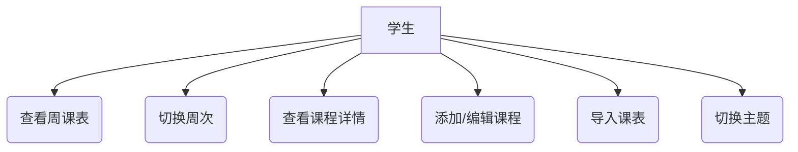
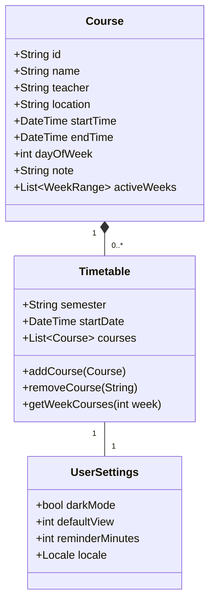
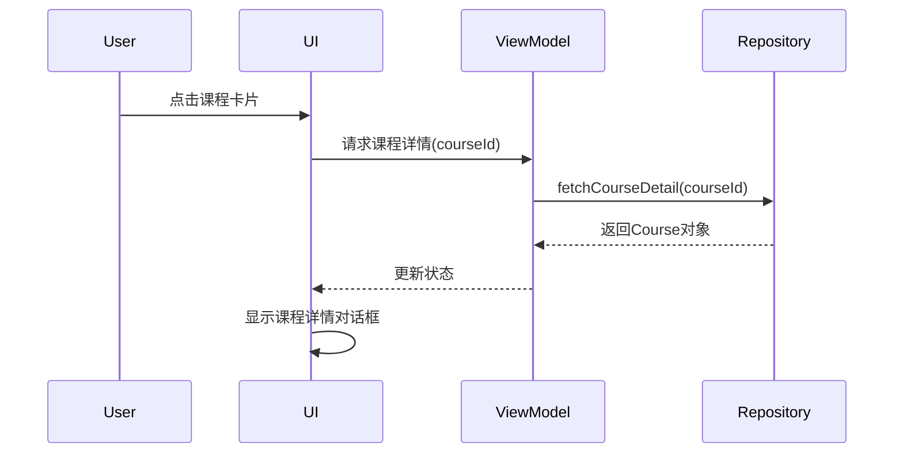
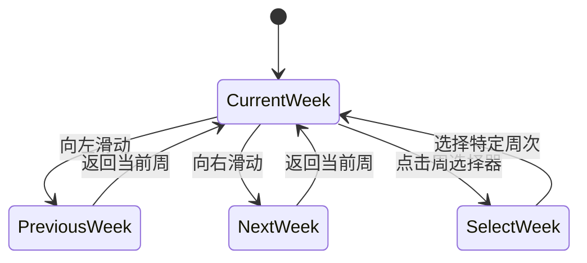

# 系统建模报告

## 用例图

```mermaid
graph TD
    A[学生] --> B(查看周课表)
    A --> C(切换周次)
    A --> D(查看课程详情)
    A --> E(添加/编辑课程)
    A --> F(导入课表)
    A --> G(切换主题)
```

## 类图

```mermaid
classDiagram
    class Course {
        +String id
        +String name
        +String teacher
        +String location
        +DateTime startTime
        +DateTime endTime
        +int dayOfWeek
        +String note
        +List~WeekRange~ activeWeeks
    }

    class Timetable {
        +String semester
        +DateTime startDate
        +List~Course~ courses
        +addCourse(Course)
        +removeCourse(String)
        +getWeekCourses(int week)
    }

    class UserSettings {
        +bool darkMode
        +int defaultView
        +int reminderMinutes
        +Locale locale
    }

    Course "1" *-- "0..*" Timetable
    Timetable "1" -- "1" UserSettings
```

## 序列图（查看课程详情）

```mermaid
sequenceDiagram
    participant User
    participant UI
    participant ViewModel
    participant Repository

    User->>UI: 点击课程卡片
    UI->>ViewModel: 请求课程详情(courseId)
    ViewModel->>Repository: fetchCourseDetail(courseId)
    Repository-->>ViewModel: 返回Course对象
    ViewModel-->>UI: 更新状态
    UI->>UI: 显示课程详情对话框
```

## 状态图（周次切换）

```mermaid
stateDiagram-v2
    [*] --> CurrentWeek
    CurrentWeek --> PreviousWeek: 向左滑动
    CurrentWeek --> NextWeek: 向右滑动
    CurrentWeek --> SelectWeek: 点击周选择器
    SelectWeek --> CurrentWeek: 选择特定周次
    PreviousWeek --> CurrentWeek: 返回当前周
    NextWeek --> CurrentWeek: 返回当前周
```
