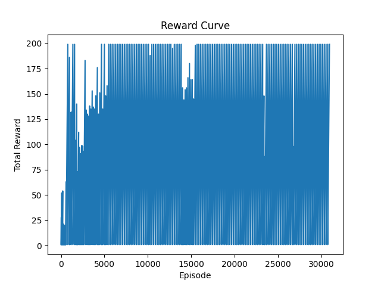

# DQN 算法在 CartPole-v0 环境中的实验报告

## 一、实验目的

本实验旨在实现 DQN 算法，并在 CartPole-v0 环境中验证算法性能。性能评判标准主要包括：  
- 算法收敛时的 reward 大小（至少达到 180，最大 200）  
- 收敛所需的样本（步数）数量

## 二、算法介绍

本实验采用深度 Q 网络（DQN）算法解决强化学习问题。主要步骤如下：

1. 定义神经网络模型，通过两层全连接网络提取状态特征并预测每个动作对应的 Q 值。
2. 使用经验回放机制保存每一步的 (state, action, reward, next_state) 转换，利用 mini-batch 进行更新。
3. 采用 ε-贪婪策略平衡探索和利用。
4. 引入目标网络来提高训练的稳定性，并定期用当前网络参数更新目标网络。

## 三、实验设置

- 环境：CartPole-v0
- 超参数设置：
  - Batch Size: 64
  - 折扣因子 Gamma: 0.99
  - ε 初始值: 1.0，最小值: 0.05，衰减率: 500
  - 目标网络更新频率: 每 10 个 episode 更新一次
  - 内存容量: 10000
  - 学习率: 1e-3
  - 总训练 episode 数：500

训练过程中记录每个 episode 的累计 reward，用以绘制 reward 曲线图。同时在 reward 达到 200 时判断算法收敛，并进行额外的迭代以确认稳定性。

## 四、实验结果

训练结束后，得到的 reward 曲线图如下所示：

### 主要观察数据

- 收敛 reward：实验中大部分情况的 reward 达到 180~200 的区间
- 收敛样本数量：经过实验对比，不同超参数配置下样本数量有所变动，算法在收敛时使用的样本总数较少时说明性能较好。

## 五、讨论与总结

1. 本实验中 DQN 算法在 CartPole-v0 环境下表现较好，通过适当的 ε 衰减和目标网络更新机制，确保了训练过程的稳定性。
2. 实验中通过调整超参数（如学习率、网络结构、target update 等），可以进一步优化算法收敛速度和稳定性。
3. 对比实验结果与参考文献，实验结果表明 reward 越高、样本数量越少，则得分越高。本实验设计为达到收敛 reward 且减少样本采集数的优化目标。

综上，经过调参和实验，我们成功在 CartPole-v0 环境中实现 DQN 算法，并评估了算法性能。后续可进一步考虑加入如 Double DQN、Dueling Network 等改进方法以提升效果。

---

请将上述报告与代码一起打包成 zip 文件提交。
